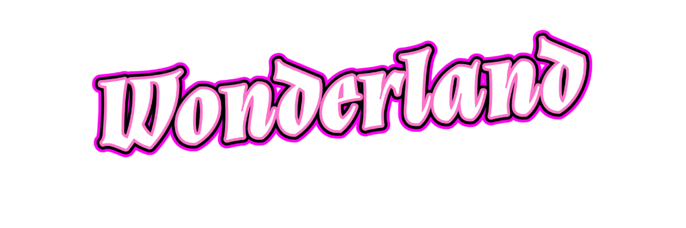

# Advanced Swarm AI Platform

An innovative platform that transforms complex multi-agent interactions into an engaging, user-centric experience of intelligent behavior modeling. Watch AI-driven agents collaborate, learn, and adapt in real-time while collecting resources and optimizing their collective behavior.

## 🚀 Features

### Real-time Swarm Visualization
- Interactive canvas-based rendering of swarm agents
- Dynamic agent behavior visualization with color-coded states
- Smooth animation of agent movements and interactions
- Click-to-add resource placement system

### Intelligent Agent Behavior
- OpenAI-powered decision making
- Advanced flocking algorithms with cohesion, separation, and alignment
- Role-based behavior (leaders and followers)
- Adaptive speed and movement patterns
- Memory-based learning from past interactions

### Resource Management
- Multiple resource types (energy, material, data)
- Visual resource indicators and value display
- Real-time resource collection tracking
- Interactive resource placement system
- Resource clustering and distribution strategies

### Performance Analytics
- Real-time efficiency metrics
- Resource collection rate tracking
- Area coverage analysis
- AI performance monitoring
- Smart optimization suggestions

### Customizable AI Configuration
- User-friendly configuration wizard
- Fine-tune AI parameters
- Adjustable decision intervals
- Customizable communication ranges
- Adaptive behavior settings

### Environmental Features
- Dynamic obstacle placement
- Special effect zones
- Boundary awareness
- Resource-rich areas
- Terrain variability

## 🔧 Technical Stack

- **Frontend**: React + TypeScript
- **Backend**: Node.js + Express
- **Database**: PostgreSQL with Drizzle ORM
- **AI Integration**: OpenAI GPT-4
- **Rendering**: HTML5 Canvas
- **State Management**: TanStack Query
- **UI Components**: shadcn/ui

## 🌟 Future Development Potential

### Enhanced Learning Capabilities
- Implement reinforcement learning for agent behavior
- Add genetic algorithms for evolving optimal strategies
- Develop agent specialization based on past performance
- Create behavior pattern recognition systems
- Enable cross-agent knowledge sharing

### Advanced Visualization
- 3D visualization support
- Heat maps for resource distribution
- Agent trajectory tracking
- Performance visualization overlays
- Real-time behavior analysis graphs

### Extended Applications
- **Industrial Optimization**
  - Warehouse robot coordination
  - Supply chain logistics
  - Manufacturing process optimization
  - Traffic flow management

- **Scientific Research**
  - Biological system simulation
  - Particle behavior studies
  - Social behavior modeling
  - Ecosystem dynamics

- **Educational Tools**
  - Interactive learning environments
  - Behavior programming tutorials
  - AI concept visualization
  - System dynamics education

### Enhanced Analysis Tools
- Machine learning-based pattern detection
- Predictive performance modeling
- Comparative analysis between different configurations
- Custom metric definition and tracking
- Detailed behavioral analytics

### Expanded Integration
- Integration with external AI models
- Real-world data input processing
- API for external system control
- Custom behavior plugin system
- Real-time collaboration features

## 🎯 Target Applications

1. **Research & Development**
   - Test swarm algorithms
   - Validate collective behavior theories
   - Prototype robotic control systems

2. **Education**
   - Teach AI concepts
   - Demonstrate emergent behavior
   - Explore system dynamics

3. **Industrial Planning**
   - Optimize resource allocation
   - Plan autonomous systems
   - Design efficient workflows

4. **Gaming & Entertainment**
   - Create interactive simulations
   - Design game AI systems
   - Develop educational games

## 📈 Performance Optimization

The platform currently includes:
- Real-time performance metrics
- Efficiency calculations
- Coverage analysis
- Resource collection tracking
- Optimization suggestions

Future optimizations could include:
- GPU acceleration
- Advanced caching strategies
- Distributed processing
- Custom WebAssembly modules
- Adaptive performance scaling

## 🤝 Contributing

We welcome contributions! Areas of particular interest:
- New agent behaviors
- Performance optimizations
- Visualization enhancements
- Analysis tools
- Documentation improvements

## 📝 License

MIT License - Feel free to use, modify, and distribute this platform for your projects!

---